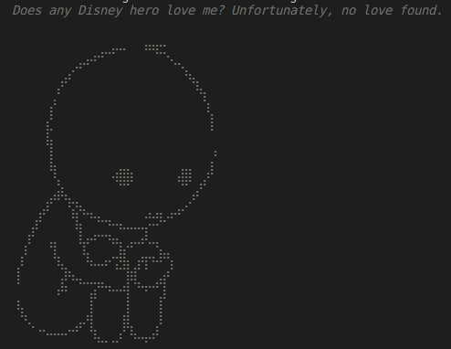

# Does any Disney Hero Love Me?

A playful showcase using RISC Zero's zkVM technology to explore verifiable computation and zero-knowledge proofs, featuring Disney characters.

## Overview
This project demonstrates how to use the RISC Zero zero-knowledge virtual machine (zkVM) to prove the correct execution of a program that checks if a specific Disney character, Belle, loves the "enemy." The demonstration is light-hearted yet highlights the capabilities of zkVM in handling verifiable computation. The program flow involves interaction between the host and guest, focusing on securely sending data, generating a proof, and extracting results in a verifiable way.

### Key Components
- **Host**: Sends input data to the guest and verifies the proof of execution.
- **Guest**: Processes the input to determine if Belle loves the "enemy" and commits the result for verification.
- **Proof Generation**: Uses zkVM to generate a self-certifying receipt, allowing verification of the guest execution without rerunning the original computation.

## Code Walkthrough

### 1. **Data Structure Definition**
A `Character` struct is defined and used by both the host and guest. This struct holds the ID and name of each Disney character:

```rust
#[derive(Debug, Serialize, Deserialize)]
struct Character {
    id: u32,
    name: String,
}
```

### 2. **Host Code**
The host code is responsible for creating the input, setting up the executor environment, and verifying the proof. It initializes an array of `Character` structs and then sends this input to the guest for processing:

```rust
let input: Vec<Character> = vec![
    Character { id: 1, name: String::from("Mickey") },
    Character { id: 2, name: String::from("Simba") },
    Character { id: 3, name: String::from("Belle") },
    Character { id: 4, name: String::from("Goofy") },
];

let env = ExecutorEnv::builder()
    .write(&input)
    .unwrap()
    .build()
    .unwrap();

// Obtain the default prover.
let prover = default_prover();

// Generate a proof and extract the receipt.
let prove_info = prover.prove(env, HELLO_GUEST_ELF).unwrap();
let receipt = prove_info.receipt;

// Decode the result from the journal.
let output: u32 = receipt.journal.decode().unwrap();
```

### 3. **Guest Code**
The guest reads the vector of characters and checks if Belle is in love with the enemy. The result (1 for love, 2 for no love) is committed to the journal:

```rust
// Function to check if a character loves the enemy
fn check_character_love(characters: &[Character]) -> u32 {
    for character in characters {
        if character.id == 3 && character.name == "Belle" {
            return 1; // Found love
        }
    }
    2 // No love found
}

fn main() {
    // Read the vector of Character structs from the input
    let received_characters: Vec<Character> = env::read();

    // Call the function to check if Belle is in the vector with id 3
    let is_love = check_character_love(&received_characters);

    // Write public output to the journal
    env::commit(&is_love);
}
```

### 4. **Print Result**
The result is printed with a visually impactful message based on the outcome. If love is found, a colorful and bold message is displayed along with some ASCII art.

```rust
print_love_status(output);
```

#### Visual Examples
- **Love Found**: When love is found, an ASCI art image is displayed via the function `print_love_status()`  


- **No Love Found**: If no love is found, another ASCI art is shown 

.

## Running the Project

1. **Dependencies**: Ensure you have the necessary dependencies installed, including the RISC Zero tools and libraries.
2. **Build and Run**: Use the following commands to build and run the project. Note that `RISC0_DEV_MODE=1` is used for development purposes only. This flag generates insecure proofs to speed up the process; **do not use it in production**.
   ```sh
   RISC0_DEV_MODE=1 cargo run --release
   ```

## Conclusion
This playful example showcases how RISC Zero's zkVM can be used to verify computation in a zero-knowledge setting. By proving the correct execution of code in a trusted environment, zkVM demonstrates the power of verifiable computation without revealing the underlying inputs. Whether it's checking for love among Disney heroes or building more serious verifiable applications, zkVM offers a versatile framework for secure, privacy-preserving computation.